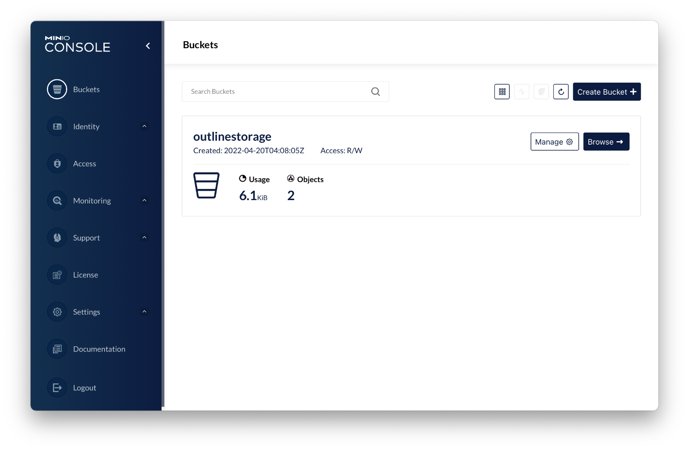

<!--
N.B.: This README was automatically generated by https://github.com/YunoHost/apps/tree/master/tools/README-generator
It shall NOT be edited by hand.
-->

# MinIO server for YunoHost

[](https://dash.yunohost.org/appci/app/minio)  

[](https://install-app.yunohost.org/?app=minio)

*[Lire ce readme en français.](./README_fr.md)*

> *This package allows you to install MinIO server quickly and simply on a YunoHost server.
If you don't have YunoHost, please consult [the guide](https://yunohost.org/#/install) to learn how to install it.*

## Overview

MinIO is a High Performance Object Storage released under GNU Affero General Public License v3.0. It is API compatible with Amazon S3 cloud storage service. Use MinIO to build high performance infrastructure for machine learning, analytics and application data workloads.


**Shipped version:** 2023.03.24~ynh1

## Screenshots



## Disclaimers / important information

## How to create a Yunohost app using MinIO
During the install process, MinIO will install both the MinIO server and MinIO client.
If your app needs to use an Amazon S3 storage, I recommend to use the MinIO client to create and setup buckets as per your app's requirements. You can have a look at outline_ynh app for reference.

### First step : retrieve MinIO credentials
```
#=================================================
# SETUP MINIO CREDENTIALS
#=================================================
minio_domain=$(ynh_app_setting_get --app="minio" --key=domain)
minio_admin=$(ynh_app_setting_get --app="minio" --key=admin)
minio_password=$(ynh_app_setting_get --app="minio" --key=password)
mc_path=$(ynh_app_setting_get --app="minio" --key=mc_path)
```

### Second step : create and setup your bucket
```
#=================================================
# SETUP MINIO BUCKET
#=================================================
ynh_script_progression --message="Setting up MinIO bucket for YOURAPP..." --weight=1

pushd "$mc_path"
	ynh_exec_warn_less sudo -u minio ./mc mb minio/NAME_OF_YOUR_BUCKET --region "NAME_OF_YOUR_REGION"
	ynh_exec_warn_less sudo -u minio ./mc policy set NEEDED_POLICY minio/NAME_OF_YOUR_BUCKET
popd
```
## Documentation and resources

* Official app website: <https://min.io>
* Official admin documentation: <https://docs.min.io/>
* Upstream app code repository: <https://github.com/minio/minio>
* YunoHost documentation for this app: <https://yunohost.org/app_minio>
* Report a bug: <https://github.com/YunoHost-Apps/minio_ynh/issues>

## Developer info

Please send your pull request to the [testing branch](https://github.com/YunoHost-Apps/minio_ynh/tree/testing).

To try the testing branch, please proceed like that.

``` bash
sudo yunohost app install https://github.com/YunoHost-Apps/minio_ynh/tree/testing --debug
or
sudo yunohost app upgrade minio -u https://github.com/YunoHost-Apps/minio_ynh/tree/testing --debug
```

**More info regarding app packaging:** <https://yunohost.org/packaging_apps>
