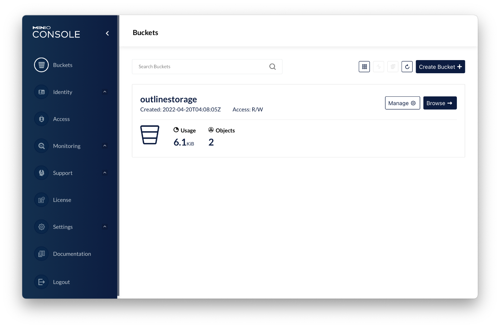

<!--
Este archivo README esta generado automaticamente<https://github.com/YunoHost/apps/tree/master/tools/readme_generator>
No se debe editar a mano.
-->

# MinIO para Yunohost

[](https://ci-apps.yunohost.org/ci/apps/minio/)


[](https://install-app.yunohost.org/?app=minio)

*[Leer este README en otros idiomas.](./ALL_README.md)*

> *Este paquete le permite instalarMinIO rapidamente y simplement en un servidor YunoHost.*  
> *Si no tiene YunoHost, visita [the guide](https://yunohost.org/install) para aprender como instalarla.*

## Descripción general

MinIO is a High Performance Object Storage. It is API compatible with Amazon S3 cloud storage service. Use MinIO to build high performance infrastructure for machine learning, analytics and application data workloads.


**Versión actual:** 2025.02.18~ynh1

## Capturas



## Documentaciones y recursos

- Sitio web oficial: <https://min.io>
- Documentación administrador oficial: <https://docs.min.io/>
- Repositorio del código fuente oficial de la aplicación : <https://github.com/minio/minio>
- Catálogo YunoHost: <https://apps.yunohost.org/app/minio>
- Reportar un error: <https://github.com/YunoHost-Apps/minio_ynh/issues>

## Información para desarrolladores

Por favor enviar sus correcciones a la [rama `testing`](https://github.com/YunoHost-Apps/minio_ynh/tree/testing).

Para probar la rama `testing`, sigue asÍ:

```bash
sudo yunohost app install https://github.com/YunoHost-Apps/minio_ynh/tree/testing --debug
o
sudo yunohost app upgrade minio -u https://github.com/YunoHost-Apps/minio_ynh/tree/testing --debug
```

**Mas informaciones sobre el empaquetado de aplicaciones:** <https://yunohost.org/packaging_apps>
